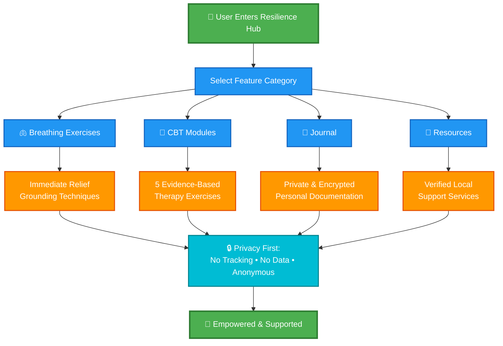

# Resilience Hub

## About

Resilience Hub is a web application designed to support survivors of digital harm by providing safe, anonymous tools for mental health recovery and resilience building. It addresses theme No.2 "Survivor Support" theme by offering guidance through therapeutic exercises, connection to local help resources, and secure documentation in a completely private environment.

### Functionality

- **Breathing Exercises**: Immediate calming techniques for anxiety and panic, helping users feel grounded during moments of distress.
- **CBT Modules**: 5 evidence-based cognitive behavioral therapy exercises specifically designed for processing digital trauma and rebuilding mental resilience.
- **Journal**: A private, encrypted space for users to document their personal journeys and thoughts securely.
- **Resources**: Access to verified crisis hotlines, counseling centers, NGOs, and legal aid services across African regions.

## Application Functionality Flow



The application prioritizes user privacy with no tracking, no data collection, and full anonymity to ensure a supportive space for recovery.


Follow these steps:

```sh
# Step 1: Clone the repository using the project's Git URL.
git clone <YOUR_GIT_URL>

# Step 2: Navigate to the project directory.
cd <YOUR_PROJECT_NAME>

# Step 3: Install the necessary dependencies.
npm i

# Step 4: Start the development server with auto-reloading and an instant preview.
npm run dev
```

**Edit a file directly in GitHub**

- Navigate to the desired file(s).
- Click the "Edit" button (pencil icon) at the top right of the file view.
- Make your changes and commit the changes.

**Use GitHub Codespaces**

- Navigate to the main page of your repository.
- Click on the "Code" button (green button) near the top right.
- Select the "Codespaces" tab.
- Click on "New codespace" to launch a new Codespace environment.
- Edit files directly within the Codespace and commit and push your changes once you're done.

## What technologies are used for this project?

This project is built with:

- Vite
- TypeScript
- React
- shadcn-ui
- Tailwind CSS

## Authentication & Email OTP Setup

This project includes a complete authentication flow:
1. **Sign Up**: New users create an account with username, email, and password.
2. **Login**: Users login with email and password; a 6-digit OTP is sent to their email.
3. **Verify**: Users enter the OTP to complete login and access the app.

### Running the application locally

You need to run both the frontend and the email relay backend.

**Step 1: Setup SMTP credentials**
Copy `server/.env.example` to `server/.env` and add your SMTP credentials:

```bash
# Using SendGrid SMTP:
SERVER_PORT=4000
SMTP_HOST=smtp.sendgrid.net
SMTP_PORT=587
SMTP_SECURE=false
SMTP_USER=apikey
SMTP_PASS=YOUR_SENDGRID_API_KEY
FROM_EMAIL=noreply@yourdomain.com
```

Or use Gmail (requires app password):
```bash
SERVER_PORT=4000
SMTP_HOST=smtp.gmail.com
SMTP_PORT=587
SMTP_SECURE=false
SMTP_USER=your.email@gmail.com
SMTP_PASS=your_app_password
FROM_EMAIL=your.email@gmail.com
```

**Step 2: Install and run the email relay server**
```powershell
cd server
npm install
npm run dev
# Server runs on http://localhost:4000
```

**Step 3: In another terminal, run the frontend**
```powershell
cd ..
npm install
npm run dev
# Open http://localhost:5173 (or the URL Vite shows)
```

### Testing the flow

1. **First visit**: You'll be redirected to `/signup`.
2. **Sign up**: Enter username, email, password → you'll be sent to `/login`.
3. **Login**: Email and password are prefilled. Click "Send verification code" → OTP is emailed to your inbox.
4. **Verify**: Enter the 6-digit OTP from your email → you'll land on the homepage.
5. **Return visits**: If users already exist, you'll go to `/login` directly (skip signup).

### Security notes

- **Client-side demo**: User credentials are stored in `localStorage` (plaintext). For production, use a backend database with bcrypt password hashing.
- **Email relay**: The `server/index.js` relays OTPs via SMTP. Never expose SMTP credentials to the client — keep them in `server/.env` only.
- **Optional env var**: To change the server URL from the default `http://localhost:4000`, add `VITE_EMAIL_SERVER_URL=...` to `.env.local` and restart the frontend.


