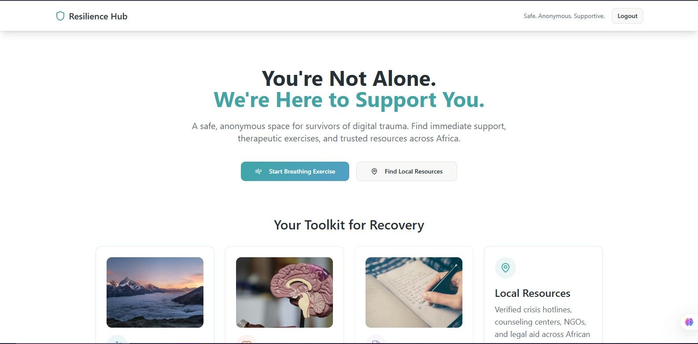
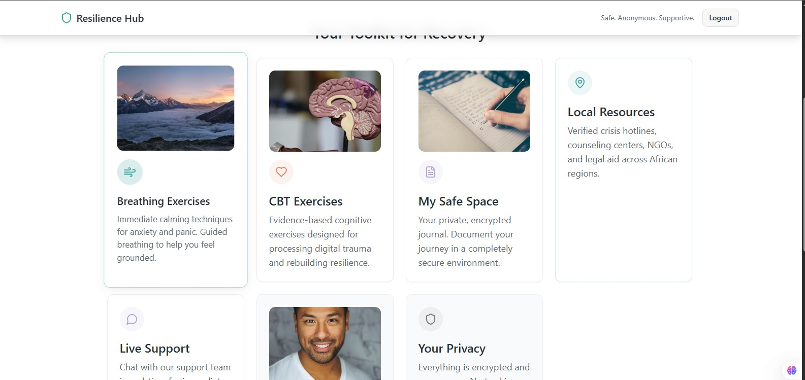

# Resilience Hub

A **privacy‑focused mental health web application** designed to support survivors of digital harm across Africa through anonymous access to CBT tools, guided breathing, journaling, and verified crisis resources.

---

## 🌍 Problem

Survivors of online abuse, harassment, and digital harm often face:

* Fear of exposure when seeking help
* Limited access to affordable mental‑health support
* Lack of region‑specific crisis resources in Africa

Safe Haven Africa addresses this by providing **anonymous, secure, and trauma‑informed mental health support** without requiring users to reveal their identity.

---

## ✨ Key Features

* 🔐 **Anonymous Authentication** – Users can access support without exposing personal identity
* 🧠 **CBT Modules** – Evidence‑based cognitive behavioral therapy exercises
* 🌬️ **Guided Breathing Exercises** – Grounding tools for anxiety and panic
* 📓 **Private Journaling** – Secure space for emotional reflection
* 🚨 **African Crisis Resources** – Localized helplines and support organizations
* 🛡️ **Privacy‑First Design** – No tracking, minimal data collection

---
## 📸 Screenshots
### Dahboard Page

### CBT Page

### Crisis Resources


---
## 👥 Demo Access

To allow full evaluation of the platform, please use the demo credentials below:

```
Email: demo@safehaven.app
Password: demo1234
```

> ⚠️ Demo account is read‑only. Data may reset periodically.

---

## 🧪 How to Explore the App

1. Visit: [https://safe-haven-africa.vercel.app](https://safe-haven-africa.vercel.app)
2. Log in using the demo credentials above
3. Watch the demo vedio here: [https://youtu.be/IraZwlWeJ9w]
5. Navigate through:

   * CBT modules
   * Breathing exercises
   * Journaling interface
   * Crisis resources section

---

## 🛠️ Tech Stack

**Frontend:**

* Typescript
* React js

**Backend:**

* Node.js
* Express js

**Database:**

* MongoDB

**Deployment:**

* Vercel

---

## 🤝 Team Collaboration

This project was built collaboratively as a team effort. Contributions included:

* UI/UX design and trauma‑informed user flows
* Frontend feature implementation
* Backend authentication and security
* Resource research and localization for Africa

---

## 💡 Impact

* Increased anonymous access to mental‑health tools
* Reduced barriers to seeking help for survivors of digital harm
* Improved emotional self‑regulation and awareness

---

## 🔮 Future Improvements

* Guest mode access for faster onboarding
* Offline‑friendly resources
* Multi‑language support
* Professional therapist integration

---

## 📬 Contact

For questions or feedback:

**Email: Lynnkati18@gmail.com**

---
