# Resilience Hub

## About

Resilience Hub is a web application designed to support survivors of digital harm by providing safe, anonymous tools for mental health recovery and resilience building. It addresses theme No.2 "Survivor Support" theme by offering guidance through therapeutic exercises, connection to local help resources, and secure documentation in a completely private environment.

### Functionality

- **Breathing Exercises**: Immediate calming techniques for anxiety and panic, helping users feel grounded during moments of distress.
- **CBT Modules**: 5 evidence-based cognitive behavioral therapy exercises specifically designed for processing digital trauma and rebuilding mental resilience.
- **Journal**: A private, encrypted space for users to document their personal journeys and thoughts securely.
- **Resources**: Access to verified crisis hotlines, counseling centers, NGOs, and legal aid services across African regions.

## Application Functionality Flow

```mermaid
flowchart TD
    Start["🏥 User Enters Resilience Hub"]
    
    Start --> Category["Select Feature Category"]
    
    Category --> Breathing["🫁 Breathing Exercises"]
    Category --> CBT["🧠 CBT Modules"]
    Category --> Journal["📓 Journal"]
    Category --> Resources["🔗 Resources"]
    
    Breathing --> BreathDesc["Immediate Relief<br/>Grounding Techniques"]
    CBT --> CBTMenu["5 Evidence-Based<br/>Therapy Exercises"]
    Journal --> JournalDesc["Private & Encrypted<br/>Personal Documentation"]
    Resources --> ResDesc["Verified Local<br/>Support Services"]
    
    BreathDesc --> Privacy["🔒 Privacy First:<br/>No Tracking • No Data • Anonymous"]
    CBTMenu --> Privacy
    JournalDesc --> Privacy
    ResDesc --> Privacy
    
    Privacy --> FinalEnd["💪 Empowered & Supported"]
    
    classDef startStyle fill:#4CAF50,stroke:#2E7D32,stroke-width:3px,color:#fff
    classDef mainStyle fill:#2196F3,stroke:#1565C0,stroke-width:2px,color:#fff
    classDef featureStyle fill:#FF9800,stroke:#E65100,stroke-width:2px,color:#fff
    classDef privacyStyle fill:#00BCD4,stroke:#00838F,stroke-width:2px,color:#fff
    classDef finalStyle fill:#4CAF50,stroke:#2E7D32,stroke-width:3px,color:#fff
    
    class Start startStyle
    class Category mainStyle
    class Breathing,CBT,Journal,Resources mainStyle
    class BreathDesc,CBTMenu,JournalDesc,ResDesc featureStyle
    class Privacy privacyStyle
    class FinalEnd finalStyle
```



The application prioritizes user privacy with no tracking, no data collection, and full anonymity to ensure a supportive space for recovery.


Follow these steps:

```sh
# Step 1: Clone the repository using the project's Git URL.
git clone <YOUR_GIT_URL>

# Step 2: Navigate to the project directory.
cd <YOUR_PROJECT_NAME>

# Step 3: Install the necessary dependencies.
npm i

# Step 4: Start the development server with auto-reloading and an instant preview.
npm run dev
```

**Edit a file directly in GitHub**

- Navigate to the desired file(s).
- Click the "Edit" button (pencil icon) at the top right of the file view.
- Make your changes and commit the changes.

**Use GitHub Codespaces**

- Navigate to the main page of your repository.
- Click on the "Code" button (green button) near the top right.
- Select the "Codespaces" tab.
- Click on "New codespace" to launch a new Codespace environment.
- Edit files directly within the Codespace and commit and push your changes once you're done.

## What technologies are used for this project?

This project is built with:

- Vite
- TypeScript
- React
- shadcn-ui
- Tailwind CSS


